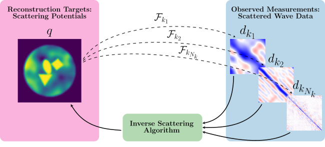
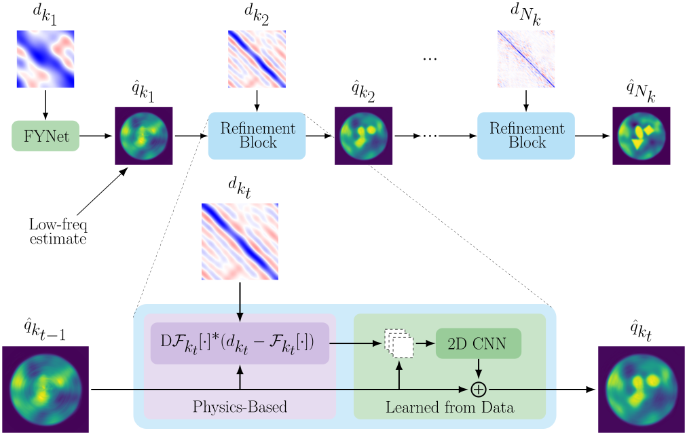
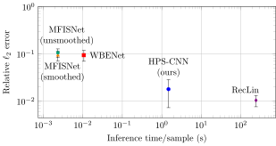
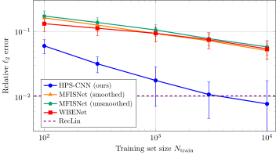

# Model-Guided Neural Network for the Inverse Scattering Problem
Code and experiments for the preprint "A Model-Guided Neural Network Method for the Inverse Scattering Problem", available on ArXiv [here](https://arxiv.org/abs/2512.10123).

Written by [Olivia Tsang](http://github.com/oortsang), [Owen Melia](https://meliao.github.io), [Vasileios Charisopoulos](https://people.ece.uw.edu/vasilis/index.html), [Jeremy Hoskins](http://www.jghoskins.com/), [Yuehaw Khoo](https://www.stat.uchicago.edu/~ykhoo/), and [Rebecca Willett](https://willett.psd.uchicago.edu/).

This code repository was written jointly by Olivia Tsang and Owen Melia, adapted from the [MFISNets repository](https://github.com/meliao/mfisnets) for our previous paper on [neural networks using multi-frequency progressive refinement](https://arxiv.org/abs/2405.13214) built using the [`jaxhps`](https://github.com/meliao/jaxhps) solver.
The repository is focused on a model-guided neural network, HPS-CNN, which seeks to achieve fast, high-quality reconstructions by incorporating physical knowledge of the forward model with prior knowledge of the target scattering potentials. The architecture involves an alternating sequence of learned components (an initial FYNet block, proposed by [Fan and Ying (2022)](https://doi.org/10.4310/AMSA.2022.v7.n1.a2), and 2D CNNs later on) and calls to a numerical PDE solver (HPS, see [Melia et al. (2026)](https://doi.org/10.1016/j.jcp.2025.114549) for details).
Additionally, this repository contains a custom implementation of the recursive linearization algorithm as a classical, non-machine-learning baseline ([Chen, 1995](https://www.cs.yale.edu/publications/techreports/tr1088.pdf); [Borges et al., 2017](16M1093562)).

The inverse scattering problem is a computationally challenging reconstruction task in wave-based imaging. In addition to enabling real-world applications--like medical imaging, remote sensing, and non-destructive testing--the inverse scattering problem is interesting to study as a classic example of an ill-posed, nonlinear inverse problem. The goal is to image the interior of an object based on how waves (e.g., acoustic or electromagnetic) traveling through the object get scattered. We focus on the multi-frequency setting, depicted below, where we have access to scattered wave measurements taken using incident waves of multiple frequencies.



In the paper, we develop a method that recovers high-quality reconstructions orders of magnitude more quickly than classical baselines. To this end, we embed a forward model--as a differential PDE solver--into a neural network architecture. This strategy leverages both physical knowledge of the wave scattering model and prior knowledge of imaging targets learned from training data.

Our proposed architecture, HPS-CNN, is illustrated below. It produces an initial estimate from low-frequency measurements, using FYNet, and progressively refines the estimate using data of increasing frequencies. In particular, each refinement step receives the previous frequency's estimate and processes it first with a fixed, physics-based component, then with a learned neural network.
The physics-based component uses a [GPU-accelerated PDE solver based on the Hierarchical Poincaré-Steklov (HPS) method](https://github.com/meliao/jaxhps). Specifically, it computes a quantity that is equivalent to the negative gradient of the incoming estimate's error in measurement space with respect to the true observations for that frequency.
The learned component uses a 2D CNN that takes in the output from the PDE solver, as well as the estimate from the previous frequency.



Our experiments find that the HPS-CNN model is able to recover accurate reconstructions with a substantial speedup compared with the classical baseline (~100x faster).
As compared to pure neural network methods, it achieves lower errors (about 5-6x lower) for a given size of training set; alternatively, it can achieve a designated error level with fewer training points (roughly 30x fewer).

Here is a plot comparing different methods by their average error on the test set and how much time is spent per test sample:



Here is a plot depicting how the different machine learning methods' performance scales with training data:



Please see our paper for all our results and more information about the experiment setup.

## Repository overview
This repository contains several neural network models, as well as several other supporting components.

- Neural network components:
  - CNN part of the HPS-CNN refinement block, in `src/models/MMGUBlock.py` (measurement misfit gradient update)
  - MFISNet-Refinement baseline in `src/models/MFISNet_Refinement.py`
  - `MFISNet_Model_Pipeline.py`
- Two differentiable PDE solvers:
  - an integral-equation solver based on the Lippmann-Schwinger equation using a PyTorch implementation of BiCGSTAB, located in `solvers/integral_equation`
  - an HPS-based solver using `jaxhps`, located in `solvers/hps/wave_scattering`
- Recursive linearization algorithm, using the HPS solver
- Utilities to manage the training/evaluation pipeline on SLURM clusters, which helps to parallelize the PDE solves during training

Additionally, we provide an notebook in `illustrative_small_scale_hpscnn_training.ipynb` for the sake of illustrating the end-to-end training process, which sets up and trains the `HPS-CNN` architecture for a small dataset of N=100 samples. Please note that this code is not optimized for speed or accuracy, so for our production implementation please refer to the "Training" and "Running pipelines" sections.

## Environment setup

We provide an environment file for use with Anaconda in `env.yaml`, or an alternate version for CPU-only systems in `cpu_env.yaml`. This environment can be created with
```
conda env create --name hpscnn-env --file env.yaml
conda activate hpscnn-env
```
We performed testing on Python 3.11 and CUDA 13.0 with the following package versions:
- torch: 2.9.1
- jax: 0.10.2
- jaxhps: 0.2
- numpy: 2.4.6
- scipy: 1.7.1
- h5py: 3.16.0

To verify that the environment is set up correctly, you can run the test suite via:
```
python -m pytest test/
```

In addition to the conda environment, we use an automated pipeline submission designed for use on Slurm clusters. In case a Slurm cluster is not available, the [Slurm Docker Cluster repo](https://github.com/giovtorres/slurm-docker-cluster) offers a way to process Slurm jobs locally.

## Training
We adopt a block-wise training strategy for the HPS-CNN model, going from low- to high-frequency measurements.
The initial block is taken as an FYNet architecture, while subsequent refinement blocks are each composed of an HPS solver and 2D CNN.
Since we process a single frequency at a time, the process can be separated into alternating training phases and HPS-application phases.
This means we only need to call the HPS solver `N_samples*(N_k - 1)` times instead of `N_epochs*N_samples*(N_k-1)`, as an end-to-end strategy may require. Thus, the additional training cost incurred by including a PDE solver is relatively modest under this strategy.

See `train_MFISNet_Fused.py`, `generate_meas_misfit_files.py`, and `train_MMGUBlock.py` for the block-wise training (and PDE solver application) scripts.

## Running pipelines
Additionally, our training (and evaluation) pipeline takes advantage of the embarassingly parallel nature of the HPS-application phases by splitting up this task among a number of Slurm nodes; this is helpful to reduce the wall-clock time, especially for larger training sets (e.g., we go up to 10,000 training samples, each with 10 frequencies).

We place the configuration files to reproduce the experiments from our paper within the `experiments` directory. These can be invoked as:

```
# Select a pipeline config, which is a python file
example_config_file='experiments/hpscnn/2025-10-02_mmg_pipeline_train_mmgu_Nk_10_(1,2,3,4,5,6,7,8,9,10)_ntr_1000_noise_0.0_epochs_300.py'
# Prepare Slurm jobs and a pipeline plan file (optional but recommended)
python generate_pipeline_scripts.py ${example_config_file}
# Submit the pipeline to Slurm
python submit_pipeline_scripts.py --use-pickled-pipeline ${example_config_file}
```
The pipeline generation step parses the configuration file and prepares Slurm scripts, then saves a pickled copy of the pipeline plan. The pipeline submission command submits a collection of jobs to Slurm and handles the dependencies between steps. This typically requires no further intervention (unless a job fails), but it is also possible to submit a subset of the underlying tasks with the `--command-str` command (for example, `--command-str="f1 f2s"` will run the first frequency block followed by just the solver task in the second frequency block; additional information, including these character codes, is available in `src/utils/pipeline_utils.py` and `src/utils/pipeline_blocks.py`).

In case you need to inspect individual files, the pipeline generation command creates a directory within `pipeline_scripts` to hold the pickled pipeline as well as Badger configuration files corresponding to each block. The individual Slurm scripts are placed in `jobs/mmg_pipeline/`.

## Recursive linearization baseline
The RecLin baseline can be invoked using [Badger](https://github.com/oortsang/badger-modified) as `python -m badger experiments/2025-10-31_config_rl_mod_{noise,ood}.yaml`. Note that you may need to set up the `logs/rl/` directory ahead of time for the Slurm submission to work; we offer a `make_log_dirs.sh` script to automatically create this directory, along with other log directories that may be required for the other experiments.

## Dataset
The dataset will be made available [via Zenodo](https://doi.org/10.5281/zenodo.21939523) (note: link may not be live yet). There are up to 10,000 scattering potentials in the training set and 1,000 in each of the validation and test sets. The measurements correspond to $\nu=k/2\pi=1,2,3,\dots,10$ (i.e., the wavelength goes from 1 per domain sidelength to 10 per domain sidelength).

```
dataset/
├── train_scattering_objs/
│   └── scattering_objs_*.h5    # Each file has 250 scattering objs
├── train_measurements_nu_*/    # We have directories for nu=k/2pi=[1,2,3,4,5,6,7,8,9,10]
│   └── measurements_*.h5       # measurements_i.h5 matches with scattering_objs_i.h5
├── val_scattering_objs/
│   └── scattering_objs_*.h5
├── val_measurements_nu_*/
│   └── measurements_*.h5
├── test_scattering_objs/
│   └── scattering_objs_*.h5
└── test_measurements_nu_*/
    └── measurements_*.h5
```
Before use, the dataset must be expanded using `do_expand_dataset.py`. This copies scattering potentials into the measurement files, as well as preparing representations in alternate coordinate representations (for FYNet) and applying low-pass-filters for the MFISNet training targets.

The scattering object files are saved in hdf5 format, with the following fields:
 * `q_cart`: the scattering potentials sampled on a Cartesian grid.
 * `q_polar`: the scattering potentials sampled on a polar grid.
 * `x_vals`: 1d coordinates of the regular Cartesian grid for the scattering domain
 * `rho_vals`: radius values of the regular polar grid for the scattering domain
 * `theta_vals`: angular values of the regular polar grid for the scattering domain. Also used as the source/receiver directions when generating measurements.
 * `seed`: the RNG seed used when generating this file.
 * `contrast`: the maximum contrast setting.
 * `background_max_freq`: the maximum frequency parameter used when defining the random background part of the scattering potentials.
 * `background_max_radius`: the radius of the disk occupied by the background field.
 * `num_shapes`: how many piecewise-constant shapes were generated.
 * `gaussian_lpf_param`: parameter used to build Gaussian lowpass filter that slightly smooths the scattering potentials.
 * `sample_completion`: array of booleans indicating whether individual samples were generated.
 * `file_completion`: single boolean set to True when the entire generation script is completed.

The measurement files are saved in hdf5 format, with all of the fields in the scattering object files and the following additional fields:

 * `nu_sf`: non-angular wavenumber (in space).
 * `omega_sf`: angular frequency (in time).
 * `q_cart_lpf`: scattering objects transformed by a Gaussian LPF, sampled on the Cartesian grid.
 * `q_polar_lpf`: scattering objects transformed by a Gaussian LPF, sampled on the polar grid.
 * `d_rs`: Measurements of the scattered wave field, in the original (receiver, source) coordinates.
 * `d_mh`: Measurements of the scattered wave field, in the (m, h) coordinates suggested by Fan and Ying, 2022.
 * `m_vals`: Coordinates of the (m, h) transformed data.
 * `h_vals`: Coordinates of the (m, h) transformed data.

## Dataset generation
The dataset uses the same scattering potentials outlined by [Melia et al. (2025)](https://arxiv.org/abs/2405.13214). The PDE solver to generate the measurement files, located in `solvers/integral_equation`, sets up an integral equation derived from the Lippmann-Schwinger equation. The resulting linear system is solved to a relative tolerance of 1e-4 by a custom, GPU-ready implementation of BiCGSTAB in PyTorch.
Note that this is a different solver from what we use in HPS-CNN, so we avoid an inverse crime.

The scripts used to generate the dataset are located in `data_generation_main` (for the primary dataset) and `data_generation_ood` (for scattering potentials with out-of-distribution contrasts).

## Notes on naming
Within the code, we adopt somewhat different naming from the paper (some of these evolved over time). We refer to the "negative gradient of error in measurement space" as the "measurement misfit gradient," or abbreviated as "MMG." Similarly, the learned component of the refinement blocks is named "MMGUBlock" for "MMG Update Block." Additionally, we invoke FYNet blocks using the MFISNet-Fused interface from our previous work, as it is strictly more general.

## Citation
If this code is helpful to your research, please cite our pre-print (and stay tuned for the forthcoming published version):

```
@misc{tsang2025modelguidedneuralnetworkmethod,
    title={A Model-Guided Neural Network Method for the Inverse Scattering Problem},
    author={Olivia Tsang and Owen Melia and Vasileios Charisopoulos and Jeremy Hoskins and Yuehaw Khoo and Rebecca Willett},
    year={2025},
    eprint={2512.10123},
    archivePrefix={arXiv},
    primaryClass={physics.comp-ph},
    url={https://arxiv.org/abs/2512.10123},
}
```
